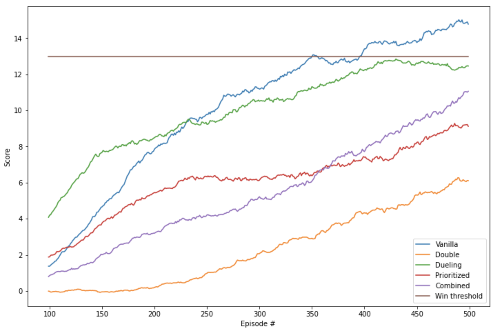

# Bananaland

This repository contains an implementation of a DQN agent to solve the Banana environment. The environment is a 3D space stochastically populated with blue and yellow bananas. At each step the agent has 4 actions (move forward, move backward, turn right and turn left). Walking over a blue banana results in a -1 reward, walking over a yellow banana results in a +1 reward. The environment is considered 'won' if the agent succeeds in getting an average reward of 13 over 100 consecutive episodes. Each episode lasts 300 steps.

Our implementation contains different variant of DQN, specifically:
- Double DQN (based on https://arxiv.org/pdf/1509.06461.pdf)
- Dueling DQN (based on https://arxiv.org/pdf/1511.06581.pdf)
- Prioritized replay DQN (based on https://arxiv.org/pdf/1511.05952.pdf)
- Distributional DQN (based on https://arxiv.org/pdf/1707.06887.pdf)

All of those variations can be combined through configuration flags. We compare their relative performance in the graph below, with 'Combined' standing for the activations of all these options in the same agent. The best performance is obtained with the combined agent, solving the environment in XX episode. Note that the comparison isn't rigorous as the environment is stochastic, running each agent multiple time and averaging their performance would yield a more robust conclusion.

## Installing the repo

If you don't have it already, install [conda](https://docs.conda.io/en/latest/miniconda.html) and create a dedicated python environment

> conda create --name bananaland python=3.6
> conda activate bananaland

From the root folder of the repo, install the python requirements

> pip install -r requirements.txt

## Setup the environment

Download depending on your system:
- Linux: click [here](https://s3-us-west-1.amazonaws.com/udacity-drlnd/P1/Banana/Banana_Linux.zip)
- Mac OSX: click [here](https://s3-us-west-1.amazonaws.com/udacity-drlnd/P1/Banana/Banana.app.zip)
- Windows (32-bit): click [here](https://s3-us-west-1.amazonaws.com/udacity-drlnd/P1/Banana/Banana_Windows_x86.zip)
- Windows (64-bit): click [here](https://s3-us-west-1.amazonaws.com/udacity-drlnd/P1/Banana/Banana_Windows_x86_64.zip)

Unzip the environment

## Running the models

Open jupyter lab (or other python notebook client you favour), open solution_walkthrough.ipynb and point it to the environment file in the second cell. You can now run the full notebook.

## Limitations

The repository was developed and tested on Mac OSX. Should you face compatibility issues on other system let us know.
Warning: the environment itself can be quite whimsical and stop answering under certain conditions. We found that restarting the notebook kernel solved some of these issues.